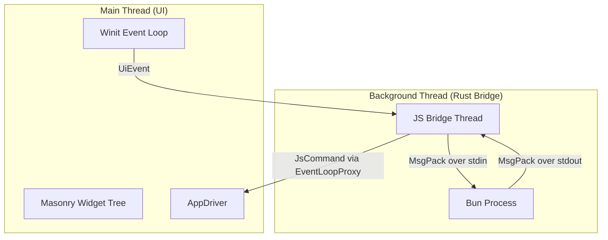

# architecture.md

This document provides an overview of the `Vellum UI` codebase structure, component
responsibilities, and interaction flows.

## 1. High-Level Architecture

`Vellum UI` uses a **dual-threaded + subprocess architecture** to keep rendering
responsive while running JavaScript logic externally.

- **UI Thread**: Handles window management, rendering, and user input.
- **JS Bridge Thread**: Spawns Bun, forwards UI events, and maps Bun messages
  into typed `JsCommand`s.
- **IPC**: Uses length-prefixed MsgPack frames over Bun stdio for cross-process
  transport.

## 2. Folder Structure & Responsibilities

### `src/`

- **`main.rs`**: Entry point. Initializes UI, creates channels, and spawns the
  JS bridge thread.

### `src/ipc/`

Defines shared communication types and protocol helpers.

| File              | Description                                                                        |
| ----------------- | ---------------------------------------------------------------------------------- |
| **`mod.rs`**      | Module exports.                                                                    |
| **`channels.rs`** | In-process channel wiring (`UiEventSender`, `UiEventReceiver`, `JsCommandSender`). |
| **`commands.rs`** | `JsCommand` enum and widget/style types sent from JS/Bun to UI.                    |
| **`events.rs`**   | `UiEvent` enum sent from UI to JS/Bun.                                             |
| **`color.rs`**    | Shared `ColorValue` parsing and representation.                                    |
| **`msgpack.rs`**  | MsgPack protocol messages and length-prefixed frame encoding/decoding.             |

### `src/js_thread/`

Hosts the Rust side of the Bun subprocess bridge.

| File                  | Description                                                                               |
| --------------------- | ----------------------------------------------------------------------------------------- |
| **`mod.rs`**          | Spawns Bun, streams MsgPack frames over stdio, and maps protocol messages to `JsCommand`. |
| **`style_parser.rs`** | Parses style JSON into strong Rust `WidgetStyle` structs.                                 |

### `src/ui_thread/`

Handles native UI behavior via `masonry`.

| File                    | Description                                                       |
| ----------------------- | ----------------------------------------------------------------- |
| **`mod.rs`**            | Builds event loop and runs UI.                                    |
| **`driver.rs`**         | `Vellum UIDriver` bridges Masonry actions and incoming `JsCommand`s.  |
| **`handler.rs`**        | Central command dispatcher that mutates widgets and window state. |
| **`creation.rs`**       | Widget creation helpers.                                          |
| **`styles.rs`**         | Style conversion helpers.                                         |
| **`widget_manager.rs`** | Maps JS widget IDs to Masonry `WidgetId`s.                        |
| **`layout.rs`**         | Initial layout helpers.                                           |

### `packages/Vellum UI-runtime/src/`

JavaScript runtime package and Bun bootstrap.

| File                | Description                                                               |
| ------------------- | ------------------------------------------------------------------------- |
| **`bun_bridge.ts`** | Runtime bridge module initialized when `@vellum/core` is imported in Bun. |
| **`ops.ts`**        | Bridge-backed command API used by `@vellum/core`.                       |
| **`events.ts`**     | Event subscription layer fed by bridge-pushed UI events.                  |
| **`index.ts`**      | Public JS API surface (`window`, `ui`, widgets, events, logging).         |

## 3. Runtime Flow

1. **`main.rs`** creates UI event loop and IPC channels, then spawns the JS
   bridge thread.
2. **`src/js_thread/mod.rs`** launches `bun run <script>` directly.
3. Importing `@vellum/core` in the Bun script initializes `bun_bridge.ts`.
4. UI actions produce `UiEvent` values which are MsgPack-encoded and streamed to
   Bun.
5. Bun/runtime API emits command messages back over MsgPack.
6. Rust bridge decodes messages to `JsCommand` and dispatches to UI via
   `EventLoopProxy`.

## 4. Key Concepts

- **Typed core messages**: Internal state transitions remain strongly typed
  (`UiEvent`, `JsCommand`).
- **Process isolation**: JavaScript runs out-of-process in Bun instead of inside
  Rust.
- **Non-blocking UI**: UI thread stays focused on rendering/input while IPC
  happens on the bridge thread.
